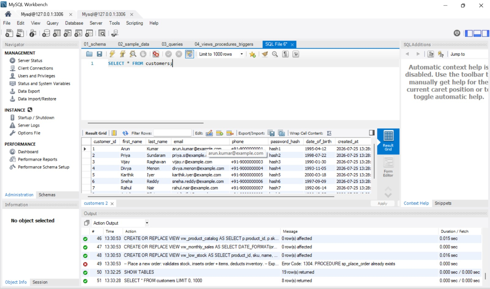
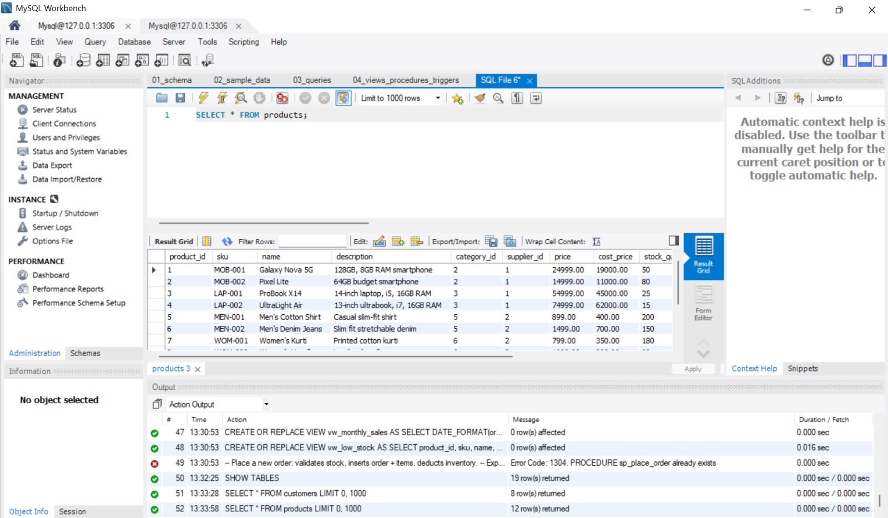
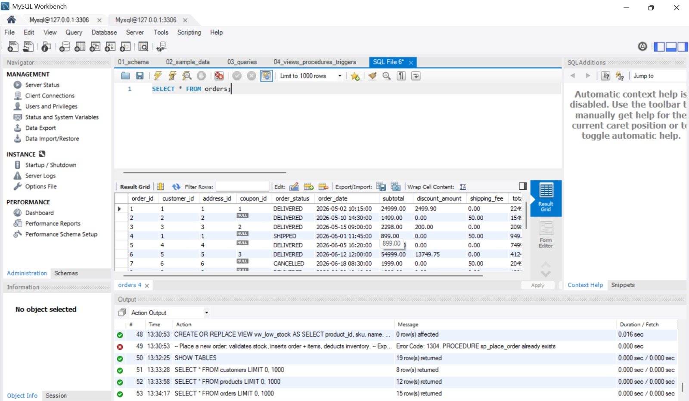
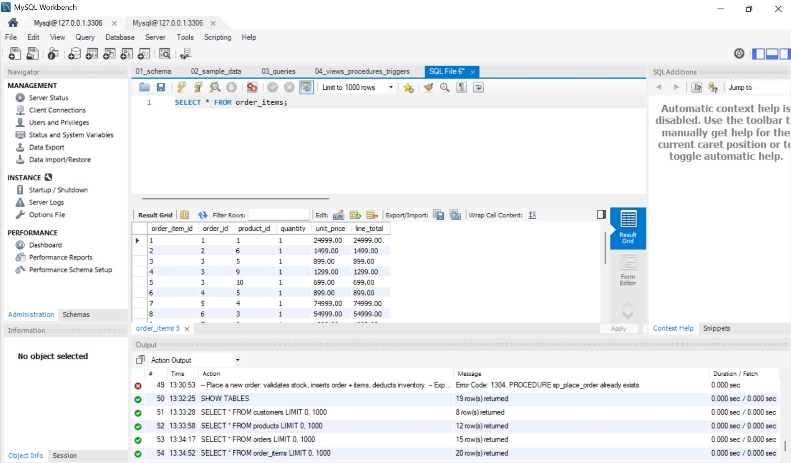
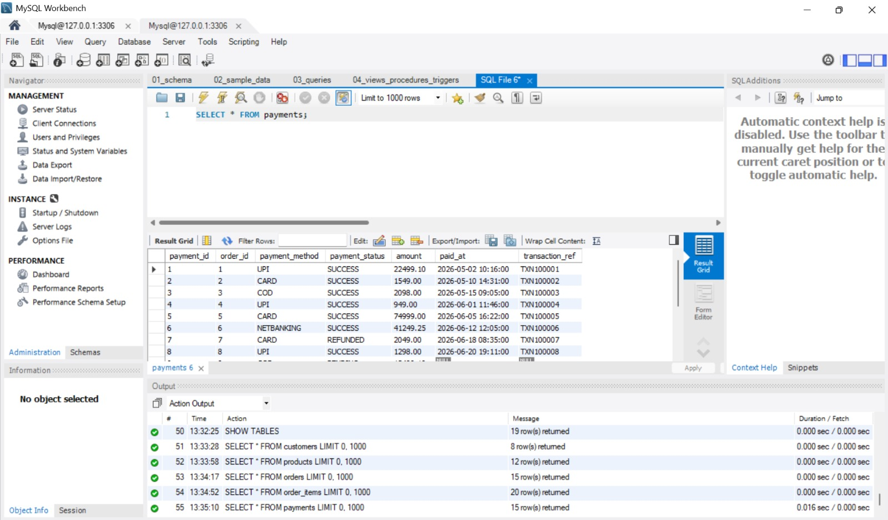
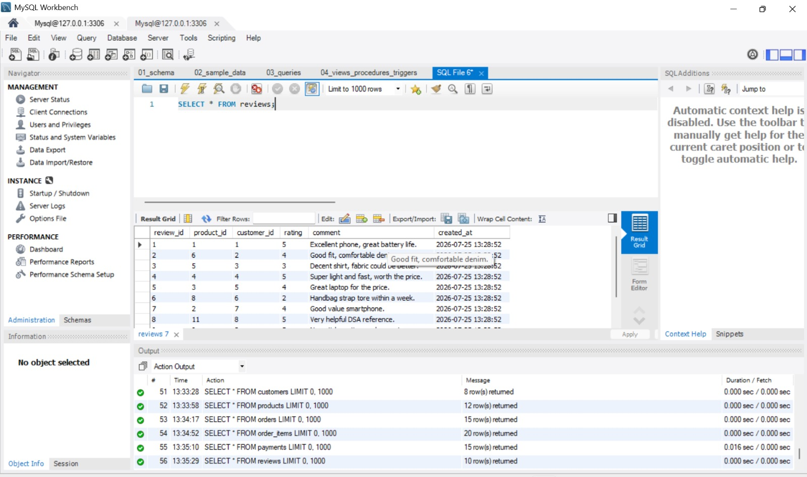
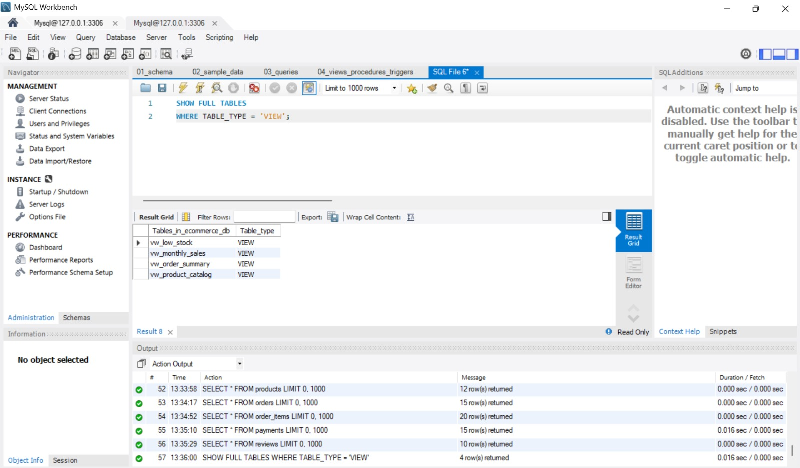
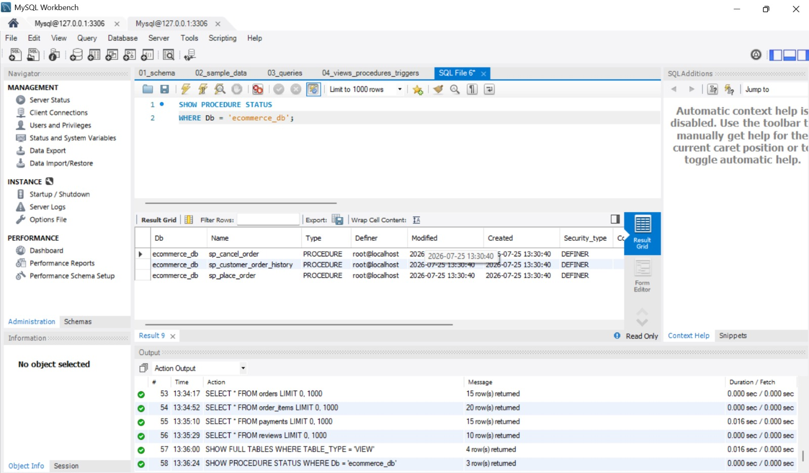
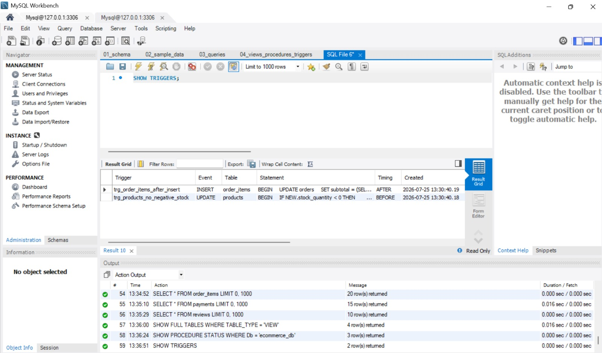

# 🛒 E-Commerce Database Management System using MySQL


A comprehensive **E-Commerce Database Management System** developed using **MySQL** to demonstrate relational database design, normalization, and advanced SQL concepts. The project simulates the core operations of an online shopping platform by managing customers, products, orders, payments, reviews, and inventory through a well-structured relational database.

---

# 📑 Table of Contents

- [Project Overview](#-project-overview)
- [Features](#-features)
- [Technologies Used](#-technologies-used)
- [Project Structure](#-project-structure)
- [Database Tables](#-database-tables)
- [Installation Guide](#-installation-guide)
- [Execution Order](#-execution-order)
- [Project Screenshots](#-project-screenshots)
- [SQL Concepts Demonstrated](#-sql-concepts-demonstrated)
- [Future Enhancements](#-future-enhancements)
- [Author](#-author)

---

# 📖 Project Overview

This project represents a complete relational database for an E-Commerce platform.

It covers the complete workflow of an online shopping system including:

- Customer Management
- Product Catalog
- Shopping Cart
- Order Processing
- Payments
- Product Reviews
- Inventory Management
- Wishlist
- Shipment Tracking
- Notifications

The project also demonstrates advanced SQL programming using **Views**, **Stored Procedures**, and **Triggers**.

---

# ✨ Features

- Relational Database Design
- Normalized Database Structure
- Primary & Foreign Keys
- Sample Data Insertion
- Complex SQL Queries
- Views
- Stored Procedures
- Triggers
- Business-Oriented SQL Reports
- Data Integrity through Constraints

---

# 🛠 Technologies Used

| Technology | Purpose |
|------------|---------|
| MySQL Server | Database Management |
| MySQL Workbench | Database Development |
| SQL | Database Programming |

---

# 📂 Project Structure

```text
E-Commerce-SQL-Database/
│
├── README.md
├── 01_schema.sql
├── 02_sample_data.sql
├── 03_queries.sql
├── 04_views_procedures_triggers.sql
│
└── screenshots/
    ├── database_tables.png
    ├── customers_data.png
    ├── products_data.png
    ├── orders_data.png
    ├── order_items_data.png
    ├── payments_data.png
    ├── reviews_data.png
    ├── views.png
    ├── procedures.png
    └── triggers.png
```

---

# 🗄 Database Tables

The database consists of **19 relational tables**, including:

- Customers
- Addresses
- Categories
- Products
- Suppliers
- Inventory Log
- Shopping Cart
- Cart Items
- Orders
- Order Items
- Payments
- Reviews
- Coupons
- Employees
- Wishlist
- Wishlist Items
- Shipments
- Returns
- Notifications

---

# ⚙ Installation Guide

## Prerequisites

- MySQL Server 8.x
- MySQL Workbench

---

## Clone the Repository

```bash
git clone https://github.com/YOUR_GITHUB_USERNAME/E-Commerce-SQL-Database.git
```

Open the SQL files using **MySQL Workbench**.

---

# ▶ Execution Order

Execute the SQL scripts in the following order:

### 1️⃣ Create Database and Tables

```text
01_schema.sql
```

### 2️⃣ Insert Sample Data

```text
02_sample_data.sql
```

### 3️⃣ Execute SQL Queries

```text
03_queries.sql
```

### 4️⃣ Create Views, Procedures and Triggers

```text
04_views_procedures_triggers.sql
```

---

# 📸 Project Screenshots

## Database Tables

Displays all the tables created after executing the schema.


---

## Customers Table

Sample customer records stored in the database.



---

## Products Table

Product catalog with pricing and stock information.



---

## Orders Table

Customer orders maintained in the system.



---

## Order Items

Relationship between orders and purchased products.



---

## Payments

Payment records associated with customer orders.



---

## Reviews

Customer ratings and reviews for products.



---

## Views

Database views created for reporting and simplified querying.



---

## Stored Procedures

Stored procedures implemented to automate database operations.



---

## Triggers

Triggers used to maintain consistency and automate actions.



---

# 📊 SQL Concepts Demonstrated

This project demonstrates practical implementation of:

- CREATE DATABASE
- CREATE TABLE
- INSERT
- UPDATE
- DELETE
- SELECT
- WHERE
- ORDER BY
- GROUP BY
- HAVING
- Aggregate Functions
- INNER JOIN
- LEFT JOIN
- RIGHT JOIN
- Subqueries
- Views
- Stored Procedures
- Triggers
- Constraints
- Primary Keys
- Foreign Keys

---

# 🎯 Learning Outcomes

Through this project, I strengthened my understanding of:

- Relational Database Design
- Database Normalization
- SQL Query Writing
- Data Integrity
- Business Database Modeling
- Advanced SQL Programming
- Database Management using MySQL

---

# 🔮 Future Enhancements

- Add indexing for query optimization
- Implement role-based database access
- Create additional analytical reports
- Integrate the database with a web application
- Add backup and recovery scripts

---

# 👩‍💻 Author

**Janani S**
**GitHub:** https://github.com/janani-1466

---

## ⭐ If you found this project useful, consider giving it a star!
